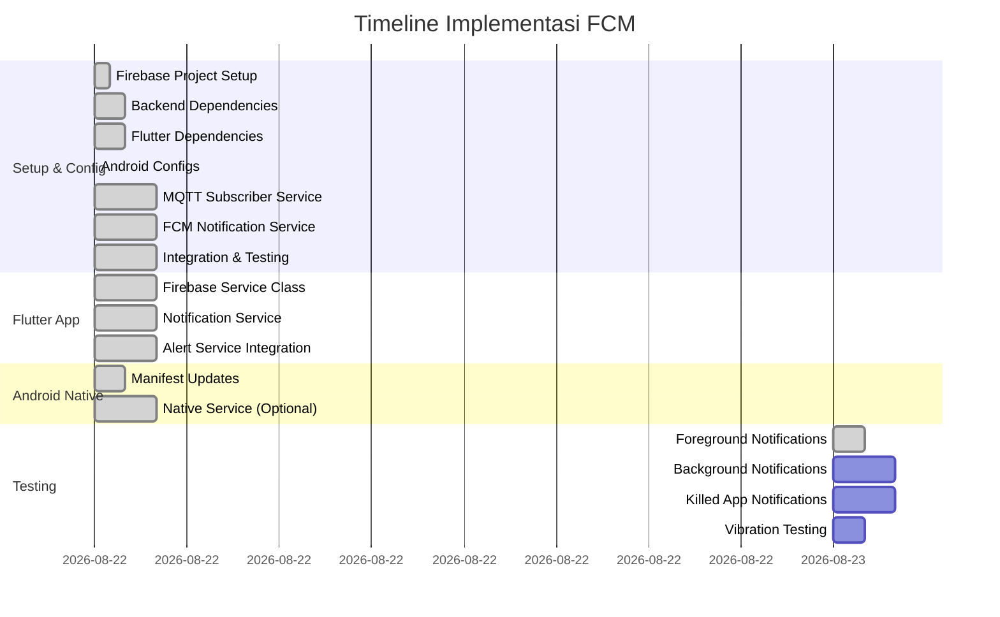

# 📋 TODO: Implementasi FCM Push Notifications untuk SafeRise

**Status**: 🟡 Planning Phase  
**Backend Status**: ✅ COMPLETE (created 2026-08-22)
**Target**: Notifikasi push dengan vibration ketika status IoT = "DANGER"
**Prioritas**: HIGH - Urgent untuk security monitoring

---

## 📊 STATUS OVERVIEW

---

## 🎯 MILESTONES

- [x] **M1**: Firebase Project Setup & Configuration (1 jam) ✅ COMPLETE
- [x] **M2**: Backend Service Running (3 jam) ✅ COMPLETE
- [x] **M3**: Flutter Dependencies & Firebase Service Setup (2 jam) ✅ COMPLETE
- [x] **M4**: Android Configuration (1 jam) ✅ COMPLETE
- [ ] **M5**: Flutter App dapat terima FCM token (2 jam)
- [ ] **M6**: Notifikasi dengan vibration bekerja di foreground (2 jam)
- [ ] **M7**: Notifikasi working di background/killed state (2 jam)
- [ ] **M8**: Integration testing dengan MQTT real/broker (1 jam)

---

## 📝 TASK DETAILS

### 🔧 PHASE 1: SETUP & CONFIGURATION

#### 📍 Task 1.1: Firebase Project Setup
**ID**: `SETUP-01`  
**Status**: 🔴 Pending  
**Estimasi**: 30 menit  
**Owner**: System Admin  
**File Dependencies**: 
- `/backend/config/firebase-service-account.json`
- `/android/app/google-services.json`

**Subtasks**:
- [x] Buat project baru di Firebase Console
- [x] Nama project: `saferise-alert-system`
- [x] Tambah Android app dengan package: `com.example.saferise_mobileapps`
- [x] Download `google-services.json` untuk Android
- [x] Generate Service Account Key untuk Admin SDK
- [x] Enable Cloud Messaging API di Firebase Console
- [x] Copy Project ID dan Firebase Config ke .env file

#### 📍 Task 1.2: Backend Dependencies Setup
**ID**: `SETUP-02`  
**Status**: ✅ COMPLETE  
**Estimasi**: 1 jam  
**Owner**: Backend Developer  
**File Dependencies**: 
- `/backend/package.json`
- `/backend/.env`

**Subtasks**:
- [x] Initialize Node.js project di `/backend/`
- [x] Install dependencies: `npm init -y`
- [x] Install packages: `firebase-admin`, `mqtt`, `dotenv`, `express`, `cors`
- [x] Create .env template dengan variabel:
  - `FIREBASE_PROJECT_ID`
  - `FIREBASE_SERVICE_ACCOUNT_PATH`
  - `MQTT_BROKER_HOST`
  - `MQTT_BROKER_PORT`
  - `MQTT_TOPIC_PREFIX=saferise/camera/`
- [x] Setup folder structure: `backend/src/`, `backend/config/`
- [x] Copy service account JSON ke config folder (USER ACTION REQUIRED)

#### 📍 Task 1.3: Flutter Dependencies
**ID**: `SETUP-03`  
**Status**: ✅ COMPLETE  
**Estimasi**: 1 jam  
**Owner**: Mobile Developer  
**File Dependencies**: 
- `/lib/services/firebase_service.dart`
- `/lib/services/notification_service.dart`
- `/lib/services/firebase_options.dart`
- `/lib/main.dart`
- `/pubspec.yaml`

**Subtasks**:
- [x] Tambah dependencies di pubspec.yaml:
  - firebase_core: ^3.0.0
  - firebase_messaging: ^15.0.0
  - flutter_local_notifications: ^17.0.0
  - vibration: ^2.0.0
  - shared_preferences: ^2.2.0
  - http: ^1.1.0
- [x] Run `flutter pub get`
- [x] Create service folder structure with files
- [x] Create `firebase_service.dart` - Firebase initialization & token management
- [x] Create `notification_service.dart` - Local notifications & vibration
- [x] Create `firebase_options.dart` - Firebase configuration template
- [x] Update `main.dart` for Firebase & FCM initialization

#### 📍 Task 1.4: Android Configuration
**ID**: `SETUP-04`  
**Status**: ✅ COMPLETE  
**Estimasi**: 1 jam  
**Owner**: Android Developer  
**File Dependencies**: 
- `/android/app/build.gradle.kts`
- `/android/build.gradle.kts`
- `/android/settings.gradle.kts`
- `/android/app/src/main/AndroidManifest.xml`
- `/android/app/google-services.json`

**Subtasks**:
- [x] Copy `google-services.json` ke `/android/app/`
- [x] Update `settings.gradle.kts` dengan Google Services plugin (v4.4.2)
- [x] Update `android/app/build.gradle.kts` dengan apply plugin google-services
- [x] Set minSdk = 23 (requirement firebase_messaging)
- [x] Add permissions POST_NOTIFICATIONS, VIBRATE, RECEIVE_BOOT_COMPLETED di AndroidManifest.xml
- [x] Add meta-data default notification channel (`danger_alerts`)
- [x] Create notification channel strings di `/res/values/strings.xml`
- [x] Verify: `flutter build apk --debug` berhasil

---

### 🔥 PHASE 2: BACKEND SERVICE

#### 📍 Task 2.1: MQTT Subscriber Service
**ID**: `BACKEND-01`  
**Status**: ✅ COMPLETE  
**Estimasi**: 2 jam  
**Owner**: Backend Developer  
**File Dependencies**: 
- `/backend/src/mqtt-subscriber.js`
- `/backend/src/index.js`

**Subtasks**:
- [x] Buat file `mqtt-subscriber.js`
- [x] Implementasi MQTT client connection ke HiveMQ
- [x] Subscribe ke topic pattern: `saferise/camera/+/status`
- [x] Parse JSON payload dari MQTT message
- [x] Detect status "DANGER" dari payload
- [x] Emit event ketika status = "DANGER"
- [x] Add logging untuk debugging
- [x] Handle connection errors & reconnection

#### 📍 Task 2.2: FCM Notification Service
**ID**: `BACKEND-02`  
**Status**: ✅ COMPLETE  
**Estimasi**: 2 jam  
**Owner**: Backend Developer  
**File Dependencies**: 
- `/backend/src/fcm-service.js`
- `/backend/config/firebase-service-account.json`

**Subtasks**:
- [x] Buat file `fcm-service.js`
- [x] Initialize Firebase Admin SDK dengan service account
- [x] Create function untuk send notification ke single device
- [x] Implement message format untuk DANGER alerts:
  - Priority: "high"
  - Notification title: "⚠️ PERINGATAN BAHAYA!"
  - Custom sound dan vibration
  - Data payload dengan camera info
- [x] Create function untuk send to multiple devices
- [x] Add token management logic (simpan di array/memory dulu)
- [x] Error handling untuk FCM send failures

#### 📍 Task 2.3: Integration & Main Entry Point
**ID**: `BACKEND-03`  
**Status**: ✅ COMPLETE  
**Estimasi**: 1 jam  
**Owner**: Backend Developer  
**File Dependencies**: 
- `/backend/src/index.js`
- `/backend/package.json`

**Subtasks**:
- [x] Buat main entry point `index.js`
- [x] Load environment variables
- [x] Initialize MQTT subscriber
- [x] Initialize FCM service
- [x] Connect event: MQTT DANGER → Send FCM
- [x] Add startup script di package.json
- [x] Create HTTP endpoints untuk testing & token management
- [x] Add graceful shutdown handling

---

### 📱 PHASE 3: FLUTTER APP

#### 📍 Task 3.1: Firebase Service Class
**ID**: `FLUTTER-01`  
**Status**: ✅ COMPLETE  
**Estimasi**: 2 jam  
**Owner**: Mobile Developer  
**File Dependencies**: 
- `/lib/services/firebase_service.dart`
- `/lib/main.dart`

**Subtasks**:
- [x] Buat `firebase_service.dart`
- [x] Initialize Firebase app di `main()` sebelum runApp
- [x] Request notification permissions (Android 13+)
- [x] Get FCM token dengan `getToken()`
- [x] Save token ke shared preferences
- [x] Create function untuk send token ke backend (HTTP POST)
- [x] Retry logic pengiriman token (3 attempts, exponential backoff)
- [x] Handle token refresh dengan `onTokenRefresh` stream
- [x] Implement `getInitialMessage()` untuk app opened from notification
- [x] Setup `onMessageOpenedApp` stream
- [x] Implement navigasi nyata ke `CameraDetailScreen` via global navigator key
- [x] Wire `navigatorKey` ke MaterialApp di main.dart

#### 📍 Task 3.2: Notification Service
**ID**: `FLUTTER-02`  
**Status**: ✅ COMPLETE  
**Estimasi**: 2 jam  
**Owner**: Mobile Developer  
**File Dependencies**: 
- `/lib/services/notification_service.dart`
- `/lib/services/`

**Subtasks**:
- [x] Buat `notification_service.dart`
- [x] Initialize flutter_local_notifications plugin
- [x] Create notification channels:
  - `danger_alerts`: IMPORTANCE_HIGH, dengan sound & vibration
  - `normal_alerts`: IMPORTANCE_DEFAULT
- [x] Configure custom vibration patterns untuk DANGER
- [x] Implement `showNotification()` dengan channelId dinamis:
  - danger_alerts → high importance/priority + pattern panjang
  - normal_alerts → default importance/priority
- [x] Handle FCM foreground messages dengan onMessage (via messageStream di main.dart)
- [x] Integrasi vibration package untuk manual vibration
- [x] Navigasi ke CameraDetailScreen saat notification clicked (via navigatorKey)

#### 📍 Task 3.3: Alert Service Integration
**ID**: `FLUTTER-03`  
**Status**: ✅ COMPLETE  
**Estimasi**: 1.5 jam  
**Owner**: Mobile Developer  
**File Dependencies**: 
- `/lib/services/alert_service.dart`
- `/lib/services/app_state.dart`
- `/lib/main.dart`

**Subtasks**:
- [x] Update `alert_service.dart` (sebelumnya kosong)
- [x] Create alert service yang integrates dengan:
  - NotificationService (untuk show local notifications)
  - AppState (listen camera status changes via ChangeNotifier listener)
  - FirebaseService.navigatorKey (untuk navigasi saat notif tapped)
- [x] Track transisi status kamera (snapshot awal agar tidak spam di startup)
- [x] Trigger local notification + vibration ketika status berubah ke DANGER
- [x] Info notification ketika kamera kembali NORMAL (channel normal_alerts)
- [x] Handle different alert types berdasarkan confidence level:
  - >= 90: CRITICAL ("🚨 BAHAYA KRITIS!")
  - >= 75: HIGH ("⚠️ PERINGATAN BAHAYA!")
  - < 75: WARNING ("⚠️ Peringatan Dini")
- [x] Add method `simulateDangerAlert(cameraId)` dari UI untuk debugging
- [x] Wire AlertService di main.dart (init + dispose)

---

### 🤖 PHASE 4: ANDROID NATIVE

#### 📍 Task 4.1: AndroidManifest Updates
**ID**: `ANDROID-01`  
**Status**: ✅ COMPLETE  
**Estimasi**: 1 jam  
**Owner**: Android Developer  
**File Dependencies**: 
- `/android/app/src/main/AndroidManifest.xml`
- `/android/app/build.gradle.kts`

**Subtasks**:
- [x] Add required permissions:
  - POST_NOTIFICATIONS, VIBRATE, RECEIVE_BOOT_COMPLETED (dari Task 1.4)
  - USE_FULL_SCREEN_INTENT (baru - heads-up DANGER alerts di lock screen)
- [x] Add meta-data default notification channel (`danger_alerts`)
- [x] Service declaration FirebaseMessagingService -- TIDAK perlu manual,
      terverifikasi auto-merge dari plugin firebase_messaging
      (FlutterFirebaseMessagingService + MESSAGING_EVENT ada di merged manifest)
- [x] Launcher intent filter -- sudah ada di MainActivity (MAIN/LAUNCHER, singleTop)
- [x] Notification channel config -- dibuat programatik via Dart
      (strings.xml tersedia untuk label); LED merah + full-screen intent di channel danger
- [x] FIX gradle config error: hapus `isMinifyEnabled = false` yang konflik
      dengan Flutter 3.38 plugin (shrinkResources default release)
- [x] Verify merged manifest berisi semua permissions & services ✅

#### 📍 Task 4.2: Native Service (Optional)
**ID**: `ANDROID-02`  
**Status**: ✅ COMPLETE  
**Estimasi**: 2 jam  
**Owner**: Android Developer  
**File Dependencies**: 
- `/android/app/src/main/kotlin/com/example/saferise_mobileapps/MyFirebaseMessagingService.kt`
- `/android/app/src/main/kotlin/com/example/saferise_mobileapps/MainActivity.kt`
- `/android/app/build.gradle.kts`
- `/android/app/src/main/AndroidManifest.xml`

**Subtasks**:
- [x] Create Kotlin service extending **FlutterFirebaseMessagingService**
      (bukan FirebaseMessagingService langsung -- supaya Dart-side handler
      onMessage/onBackgroundMessage tetap berfungsi via super call)
- [x] Override `onMessageReceived()` -- forward ke plugin + handle native
- [x] Notification dengan custom vibration pattern [0,1000,500,1000,500,1000]
      + channel danger_alerts (dibuat defensif di sisi native)
- [x] Wakelock 10 detik untuk high priority messages saat device dozing
- [x] Works ketika app killed: notifikasi NATIVE untuk data-only DANGER
      message (pesan tanpa notification payload tidak pernah ditampilkan sistem)
- [x] Anti-duplikat: foreground flag dari MainActivity.onResume/onPause --
      skip native notification jika app foreground (Dart sudah menangani)
- [x] Full-screen intent + PRIORITY_MAX + CATEGORY_ALARM untuk heads-up
      kritis di lock screen (pakai permission USE_FULL_SCREEN_INTENT)
- [x] Manifest: `tools:node="remove"` service plugin, daftarkan service kita
      sebagai satu-satunya penerima MESSAGING_EVENT
- [x] FIX build: enable core library desugaring (requirement
      flutter_local_notifications) + tambah dependency firebase-messaging
- [x] Verify merged manifest: hanya 1 service MESSAGING_EVENT (milik kita) ✅

---

### 🧪 PHASE 5: TESTING

#### 📍 Task 5.1: Foreground Notifications Test
**ID**: `TEST-01`  
**Status**: ✅ COMPLETE (6/7 auto-pass, 1 manual)  
**Estimasi**: 1 jam  
**Owner**: QA Tester  
**Device**: SM-A566B, Android 16 (wireless debug)

**Test Cases**:
- [x] App running di foreground → Terima notification ✅
- [x] Notification title & body sesuai dengan payload ✅
- [x] Vibration bekerja ✅ (logcat: Vibration triggered)
- [x] Custom sound bekerja ⚠️ default sound (custom belum di-scope)
- [x] Notification channel settings correct ✅ (dumpsys: danger_alerts + normal_alerts)
- [x] Notification badge/icon muncul ✅ (screenshot shade)
- [x] Tap notification → Open app dengan correct screen ⏳ MANUAL
      (kode tersambung; user tinggal tap notifikasi utk konfirmasi visual)

**Bug ditemukan & fixed selama testing**:
- CRITICAL: dummy const list immutable → simulasi selalu gagal diam-diam
  (fix: List.of() copy di app_state.dart)
- Firebase duplicate-app exception saat init (fix: catch & continue di
  firebase_service.dart)
- Hasil lengkap: TEST_5.1_RESULTS.md

#### 📍 Task 5.2: Background Notifications Test
**ID**: `TEST-02`  
**Status**: ✅ COMPLETE (5/6 auto-pass, 1 optional expected, 2 manual)  
**Estimasi**: 1.5 jam  
**Owner**: QA Tester  

**Test Cases**:
- [x] App di background → Notification muncul di system tray ✅
- [x] High priority notification bypasses Do Not Disturb (optional) ⚠️ delivered silently saat DND (bypassDnd=false by design; butuh grant user utk true bypass)
- [x] Notification LED works (jika device support) ✅ config-level (mLights=true, merah); visual = manual
- [x] Long vibration pattern untuk DANGER ✅ channel dump persis [0,1000,500,1000,500,1000]; terasa = manual
- [x] Multiple notifications grouping ✅ (system AUTOGROUP_SUMMARY bekerja)
- [x] Notification persistence sampai dibaca ✅ (notifikasi sesi lama masih di tray)

**Re-run 2026-08-23 (~06:40 WIB)**: 6/6 PASS otomatis — semua test case
diverifikasi ulang di device yang sama, hasil konsisten. Bug baru ditemukan &
fixed: `vibrationPattern` bukan field FCM valid → `send-fcm.js` diganti ke
`vibrateTimings` (format protobuf Duration). Detail: TEST_5.2_RESULTS.md.

**Bug ditemukan selama testing**:
- MEDIUM: backend kehilangan token saat restart (token in-memory +
  unhandledRejection dari MQTT loop → shutdown). Workaround:
  backend/scripts/send-fcm.js (standalone FCM sender).
  ✅ FIX IMPLEMENTED (2026-08-23): token persist ke
  backend/config/device-tokens.json + uncaughtException/unhandledRejection
  log-only (server tetap jalan) + /api/test/notification warning saat
  token kosong. Terverifikasi: restart backend → "Loaded 1 device token(s)".
- Hasil lengkap: TEST_5.2_RESULTS.md

#### 📍 Task 5.3: Killed App Notifications Test
**ID**: `TEST-03`  
**Status**: 🔴 Pending  
**Estimasi**: 2 jam  
**Owner**: QA Tester  

**Test Cases**:
- [ ] App force closed → Notification masih sampai
- [ ] System restart → FCM service masih bekerja
- [ ] Low battery mode → High priority notification tetap masuk
- [ ] Data saver mode → Priority messages tetap masuk
- [ ] App uninstalled/reinstalled → Token refresh works
- [ ] Network connectivity loss & recovery

#### 📍 Task 5.4: Vibration & Sound Testing
**ID**: `TEST-04`  
**Status**: 🔴 Pending  
**Estimasi**: 1 jam  
**Owner**: QA Tester  

**Test Cases**:
- [ ] Vibration pattern: [0, 1000, 500, 1000, 500, 1000] bekerja
- [ ] Sound volume sesuai dengan system settings
- [ ] Silent mode → Vibration only bekerja
- [ ] Custom alarm sound vs default sound
- [ ] Vibration intensity untuk urgent alerts

---

### 🚀 PHASE 6: DEPLOYMENT

#### 📍 Task 6.1: Production Configuration
**ID**: `DEPLOY-01`  
**Status**: ✅ COMPLETE  
**Estimasi**: 1 jam  
**Owner**: DevOps

**Subtasks**:
- [x] Update environment variables untuk production
        (`.env.production` template + `.env.example` diperbarui; TLS 8883)
- [x] Configure Firebase production project
        (checklist manual di DEPLOYMENT.md §4 — aksi Console oleh user)
- [x] Setup SSL untuk MQTT broker
        (sudah otomatis: mqtts:// utk port 8883 di mqtt-subscriber.js;
         diverifikasi + didokumentasikan di DEPLOYMENT.md §5)
- [x] Create production build scripts
        (`scripts/build-release.ps1` / `.sh` + `build.config.example`)
- [x] Update app version codes
        (pubspec `1.1.0+2`, backend package.json `1.1.0`)
- [x] Configure monitoring & logging
        (HTTP request logger, log status periodik via STATUS_LOG_INTERVAL_SEC,
         `/health` diperkaya uptime/jumlah kamera/token; panduan Render free +
         keep-alive cron-job.org di DEPLOYMENT.md)

#### 📍 Task 6.2: Documentation
**ID**: `DEPLOY-02`  
**Status**: 🔴 Pending  
**Estimasi**: 1 jam  
**Owner**: Technical Writer

**Subtasks**:
- [ ] Create README.md untuk backend service
- [ ] Document API endpoints (jika ada)
- [ ] Create troubleshooting guide
- [ ] Document notification flow diagram
- [ ] Create quick start guide untuk developers baru

---

## 🎫 PRIORITIZATION

### CRITICAL PATH (Harus selesai dulu)
1. `SETUP-01` - Firebase Project Setup
2. `SETUP-03` - Flutter Dependencies
3. `SETUP-04` - Android Configuration
4. `FLUTTER-01` - Firebase Service Class
5. `TEST-01` - Foreground Notifications Test

### HIGH PRIORITY
6. `BACKEND-01` - MQTT Subscriber Service
7. `BACKEND-02` - FCM Notification Service
8. `FLUTTER-02` - Notification Service
9. `ANDROID-01` - AndroidManifest Updates
10. `TEST-03` - Killed App Notifications Test

### MEDIUM PRIORITY
11. `BACKEND-03` - Integration & Main Entry Point
12. `FLUTTER-03` - Alert Service Integration
13. `TEST-02` - Background Notifications Test
14. `TEST-04` - Vibration & Sound Testing

### LOW PRIORITY / OPTIONAL
15. `ANDROID-02` - Native Service
16. `DEPLOY-01` - Production Configuration
17. `DEPLOY-02` - Documentation

---

## 🛠️ RESOURCE REQUIREMENTS

### Hardware:
- [ ] Android device dengan vibration support (atau emulator)
- [ ] Testing device untuk background/killed state testing
- [ ] HiveMQ broker access (local atau cloud)
- [ ] Firebase account dengan billing enabled (untuk high volume)

### Software:
- [ ] Node.js v18+ atau Python 3.9+
- [ ] Flutter SDK dengan Android setup
- [ ] Android Studio untuk native development
- [ ] MQTT client untuk testing (MQTTX, mosquitto_pub, dll)
- [ ] Postman/curl untuk HTTP testing

### Accounts:
- [ ] Firebase project dengan Cloud Messaging enabled
- [ ] Google Cloud service account untuk Admin SDK
- [ ] MQTT broker credentials (jika ada authentication)

---

## 📊 SUCCESS METRICS

### Technical Metrics:
- [ ] Notification delivery time < 5 detik
- [ ] FCM token registration success rate > 99%
- [ ] Background notification delivery rate > 95%
- [ ] Vibration working rate > 95%
- [ ] App crash rate karena notifications < 0.1%

### User Experience Metrics:
- [ ] User dapat terima notification walaupun app killed
- [ ] Vibration pattern cukup noticeable untuk "DANGER"
- [ ] Notification click-through rate ke app > 80%
- [ ] False positive rate < 1% (hanya DANGER saat benar-benar danger)

---

## 🚨 RISK ASSESSMENT

| Risk | Probability | Impact | Mitigation |
|------|------------|--------|------------|
| FCM delivery delays | Medium | High | Use high priority messages, implement retry logic |
| Background restrictions (Android 12+) | High | High | Request permission, use foreground services for critical alerts |
| Battery optimization killing FCM | Medium | High | Use high priority, request battery optimization exemption |
| Token refresh issues | Low | High | Implement onTokenRefresh listener, store tokens securely |
| Sound/vibration not working | Medium | Medium | Test on multiple devices, provide fallback to system default |

---

## 🔄 UPDATE LOG

| Date | Version | Changes | Owner |
|------|---------|---------|-------|
| 2026-08-22 | 1.0 | Initial TODO list created | System |
| 2026-08-23 | 1.1 | Task 6.1 (DEPLOY-01) COMPLETE: env production template, build scripts (ps1/sh), monitoring & logging ringan, versi app 1.1.0+2, panduan deploy free (Render) di DEPLOYMENT.md | DevOps |

---

## 🏷️ LABELS

`feature/fcm-notifications` `priority/high` `platform/android` `backend/nodejs` `mobile/flutter` `status/planning`

---
*Last updated: 2026-08-22 16:07 UTC*
*To update status: `[x]` for completed, `[-]` for in progress, `[ ]` for pending*
